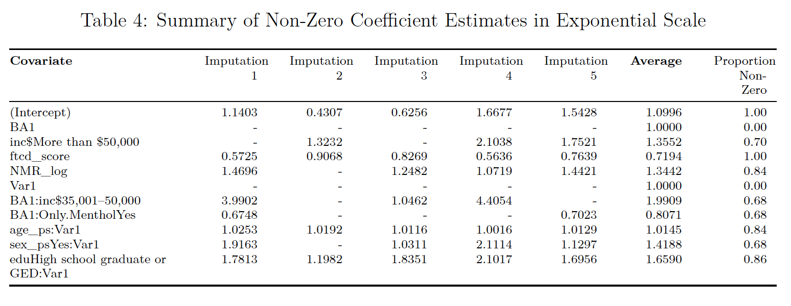

# PHP2550-Project2-Regression Analysis

### Background

This project analyzes data from a clinical trial investigating smoking cessation strategies for individuals with major depressive disorder (MDD). The study compares Behavioral Activation for Smoking Cessation (BASC) with standard treatment (ST) and examines the effectiveness of varenicline versus placebo on long-term smoking abstinence. The aim is to explore baseline variables that may moderate or predict treatment effectiveness.

### Data and Analysis Methods

The dataset includes demographic, psychological, and smoking history variables for 300 participants, split equally across four treatment groups. Data preprocessing involved multiple imputations for missing values. An exploratory analysis was conducted to identify patterns, followed by regression analysis using regularized Lasso logistic regression to select significant predictors and interactions. Cross-validation was applied to tune the model and assess generalizability.

### Results

The exploratory analysis highlighted factors such as education, age, and nicotine dependence as influential in smoking cessation outcomes. Regression analysis found varenicline to be associated with higher abstinence rates, with BASC showing additional benefit when combined with varenicline. The results indicate that nicotine dependence, nicotine metabolism, and educational attainment were consistently strong predictors of smoking abstinence, while the effects of income level and menthol cigarette use varied across treatment groups. Behavioral Activation (BA) treatment showed differential effectiveness, benefiting some subgroups, such as those with moderate income, but being less effective for menthol cigarette users. Similarly, pharmacotherapy with Varenicline demonstrated enhanced effectiveness when combined with factors like higher education and older age, with additional benefits observed among women. These findings highlight the complex interplay of demographic, behavioral, and treatment factors in influencing smoking cessation outcomes. The model demonstrated reasonable classification accuracy (AUC = 0.83), though calibration issues indicated closer alignment on training data than test data. The full report can be found [here](Report/PHP2550_Project2.pdf).

## Files

### Report
`PHP2550_Project2.Rmd`: The Rmarkdown version of the Regression Analysis report, which includes both written text interpretations and raw code used in the analysis. 

`PHP2550_Project2.pdf`: The PDF version of the Regression Analysis report, which includes both written text interpretations and a Code Appendix with the raw code used in the analysis. 

### Analysis Function
`Lasso with Bootstrap.R`: An R script that includes a function for implementing Lasso regression with bootstrap sampling.

### Visuals:
Included tables and figures in the report.

## Dependencies
The following packages were used in this analysis: 

 - Data Manipulation: `dplyr`, `tidyr`, `mice`, `caret`
 - Table Formatting: `gt`, `gtsummary`
 - Data Visualization: `ggplot2`, `ggpubr`, `ggExtra`, `gridExtra`, `predtools`, `pROC`
 - Model: `glmnet`, `boot`, `ISLR`
 
