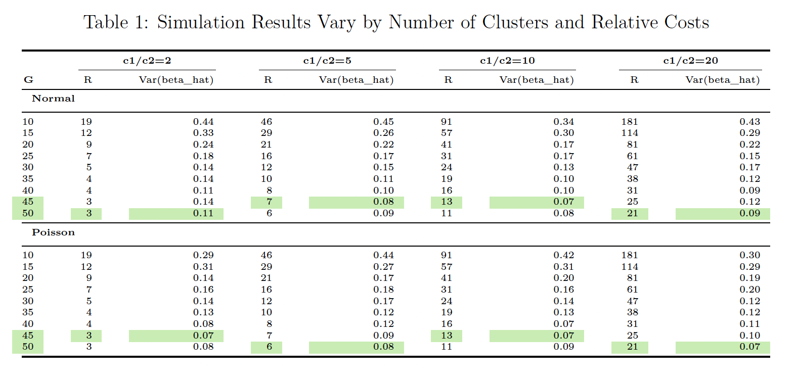

# PHP2550-Project3-Simulation

### Background

This project investigates the design of cluster randomized trials under budget constraints, focusing on optimizing the allocation of resources between the number of clusters and the number of measurements per cluster. Cluster randomized trials are commonly used in public health and clinical research to evaluate treatment effects when randomization occurs at the group level (e.g., hospitals or clinics) but outcomes are measured at the individual level. The goal of this project is to identify design strategies that minimize the variance of treatment effect estimates while balancing trade-offs between within-cluster and between-cluster variability.

### Simulation Framework

The simulation framework was guided by the ADEMP (Aims, Data-generating mechanisms, Estimands, Methods, and Performance measures) framework. Simulations were conducted using both Normal and Poisson data-generating mechanisms to reflect common outcome distributions in real-world trials. Key features of the framework in our case include:
- **Aims:** Evaluate the optimal allocation of a fixed budget across clusters ($G$) and measurements per cluster ($R$), minimizing the variance of the treatment effect estimate ($\hat{\beta}$), and assess the impact of variance components ($\sigma^2$, $\gamma^2$) and treatment effects ($\beta$) on precision and power.
    
- **Data-Generating Mechanisms:** Simulations were conducted under:
   - Normal Outcomes: Data generated using a hierarchical model with variance components $\sigma^2$ and $\gamma^2$.
   - Poisson Outcomes: Data generated with a log-linear model incorporating $\gamma^2$.
    
- **Estimand:** The treatment effect ($\beta$), representing the difference between treatment and control groups.
    
- **Methods:** Simulated datasets were analyzed using GLMs to estimate $\hat{\beta}$ and evaluate variance and power.
    
- **Performance Measures:** Variance and power were used to assess the precision of $\hat{\beta}$ and the ability to detect treatment effects across design configurations.

### Results

The results demonstrate that increasing the number of clusters ($G$) consistently reduces the variance of the treatment effect estimate ($\hat{\beta}$), though the benefits diminish beyond approximately $G = 40$. Lower cost ratios ($c_1/c_2 = 2, 5$) allocate more resources to within-cluster measurements ($R$), leading to steep reductions in variance at smaller cluster sizes, while higher cost ratios ($c_1/c_2 = 10, 20$) prioritize increasing the number of clusters, achieving low variance at larger $G$. Additionally, distributional assumptions significantly influence design performance. Under Normal outcomes, increasing residual variance ($\sigma^2$) weakens clustering effects and reduces precision, whereas Poisson outcomes are more sensitive to between-cluster variability ($\gamma^2$), which affects both variance and power. These findings emphasize the importance of tailoring design strategies to cost structures and the underlying data distribution to achieve optimal precision. The full report can be found [here](Report/PHP2550_Project3.pdf).

## Files

### Report
`PHP2550_Project3.Rmd`: The Rmarkdown version of the Regression Analysis report, which includes both written text interpretations and raw code used in the analysis. 

`PHP2550_Project3.pdf`: The PDF version of the Regression Analysis report, which includes both written text interpretations and a Code Appendix with the raw code used in the analysis. 

### Dataset
`res_normal_opt`: contains the results of simulations designed to evaluate the optimal allocation of clusters (G) and measurements per cluster (R) under the Normal distribution;
`res_normal_vary`: contains simulation results evaluating the impact of varying within-cluster variance ($\sigma^2$) and treatment effect sizes ($\beta$) on the performance of cluster randomized trial designs under normal distribution, using optimal configurations of clusters ($G$) and measurements per cluster ($R$) determined in previous steps, and includes metrics such as the variance of the treatment effect estimate ($\hat{\beta}$), power, and confidence interval coverage.

`res_poisson_opt`: contains the results of simulations designed to evaluate the optimal allocation of clusters (G) and measurements per cluster (R) under the Poisson distribution
`res_poisson_vary`: contains simulation results evaluating the impact of varying within-cluster variance ($\sigma^2$) and treatment effect sizes ($\beta$) on the performance of cluster randomized trial designs under poisson distribution, using optimal configurations of clusters ($G$) and measurements per cluster ($R$) determined in previous steps, and includes metrics such as the variance of the treatment effect estimate ($\hat{\beta}$), power, and confidence interval coverage.

### Simulaion Functions
`Simulation (Normal).R`: An R script for simulating data under a normal distribution framework.
`Simulation (Poisson).R`: An R script for simulating data under a poisson distribution framework.
`Performance of Clusters (Normal).R`: An R script for generating performance metrics across varying cluster sizes and cost ratios under a normal distribution framework.
`Performance of Clusters (Poisson).R`: An R script for generating performance metrics across varying cluster sizes and cost ratios under a poisson distribution framework.
## Dependencies

The following packages were used in this analysis: 

 - Data Manipulation: `tidyverse`, `dplyr`
 - Table Formatting: `gt`
 - Data Visualization: `ggplot2`, `ggpubr`, `RColorBrewer`
 - Model: `lmerTest`, `lme4`
 
